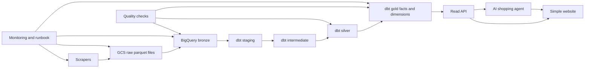

# Project Map

Use this as the entry point when you sit down to work. Pick one plan, finish one middle goal, then come back here and choose the next one.

## The Shape of the Project

## Pick a Plan

| Plan | When to pick it | Main outcome |
| --- | --- | --- |
| [01 Warehouse Gold Layer](01_warehouse_gold_layer.md) | You want to make the data model useful and stable. | Gold fact/dimension tables ready for API use. |
| [02 Automated ETL](02_automated_etl.md) | You want the pipeline to run by itself. | Scrape, load, and dbt refresh happen automatically. |
| [03 API Layer](03_api_layer.md) | You want to expose the data to apps. | FastAPI service reading from gold tables. |
| [04 Website](04_website.md) | You want a visible product people can use. | Search/filter/detail website using the API. |
| [05 Quality and Monitoring](05_quality_monitoring.md) | You want reliability and fewer surprises. | Data checks, alerts, and recovery runbook. |
| [06 AI Shopping Agent](06_ai_shopping_agent.md) | You want product Q&A and shopping-list recommendations. | Agent answers questions and allocates items across supermarkets. |

## Recommended Order

1. [01 Warehouse Gold Layer](01_warehouse_gold_layer.md)
2. [05 Quality and Monitoring](05_quality_monitoring.md), first pass only
3. [02 Automated ETL](02_automated_etl.md)
4. [03 API Layer](03_api_layer.md)
5. [06 AI Shopping Agent](06_ai_shopping_agent.md), first product Q&A pass
6. [04 Website](04_website.md)
7. [06 AI Shopping Agent](06_ai_shopping_agent.md), shopping-list allocation pass
8. [05 Quality and Monitoring](05_quality_monitoring.md), deeper pass

The key idea: do not build the API before the gold tables are clear. Do not build too much website or agent behavior before the API contract exists. Keep quality work running alongside the pipeline instead of saving it all for the end.

## Dependency Map

| This depends on | Before doing this |
| --- | --- |
| Gold facts and dimensions | API endpoints |
| Gold facts and dimensions | Website filters and charts |
| Product search API | AI product Q&A |
| Product matching logic | Shopping-list supermarket allocation |
| Bronze load consistency | Automated dbt refresh |
| API response models | Website implementation |
| Row-count checks | Trusting automation |
| Runbook | Production-ish daily operation |

## First Small Wins

If you only have one hour, pick one of these:

- Add docs and tests for `fact_products_today`.
- Draft `fact_product_price_snapshots`.
- Write the BigQuery row-count query for today's bronze loads.
- Create the skeleton `api/` folder and `/health`.
- Draft the agent's expected answer format for product Q&A.
- Sketch the website pages without implementing the UI.

## How to Work Through a Plan

Each plan has the same structure:

- Target: what the plan is trying to achieve.
- Start here: the first useful action.
- Middle goals: small checkpoints.
- Build checklist: concrete implementation tasks.
- Done when: exit criteria.
- Later: ideas to postpone.

Try to finish one middle goal at a time. That keeps the project moving without turning every session into architecture soup.
